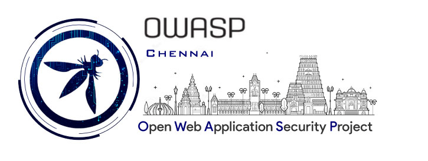

## Welcome
Include some information here about your chapter



## Participation
The Open Web Application Security Project (OWASP) is a nonprofit foundation that works to improve the security of software. All of our projects ,tools, documents, forums, and chapters are free and open to anyone interested in improving application security. 

Chapters are led by local leaders in accordance with the Chapter Leader Handbook. Financial contributions should only be made online using the authorized online donation button. To be a SPEAKER at ANY OWASP Chapter in the world simply contact the local chapter leader with details of what OWASP Project, independent research, or related software security topic you would like to present.

Everyone is welcome and encouraged to participate in our [Projects](/projects), [Local Chapters](/chapters), [Events](/events), [Online Groups](https://groups.google.com/a/owasp.com/){:target='_blank'}, and [Community Slack Channel](https://owasp.slack.com/){:target='_blank'}. We especially encourage diversity in all our initiatives. OWASP is a fantastic place to learn about application security, to network, and even to build your reputation as an expert. We also encourage you to be [become a member](/membership) or consider a [donation](/donate) to support our ongoing work.

## Upcoming Events
```Follow us on Twitter to know about more upcoming events and instant updates```

# **Chennai OWASP Chapter Leaders**

## Current Chapter Leaders

### Venkatraman Kumar (Sep 2020 - Present)

### Muktheeswaran Mariappan (Sep 2020 - Present)

## Previous Chapter Leaders

### Chintu Philips Koshy (Jan 2017 - Aug 2020)

### Santhosh Kumar (Jan 2017 - Present)

### Aardash Nagalingam (March 2017 - August 2019)

### Venkatesh Jagannathan (2009 - 2015)

### Chandrasekar Umapathy(2009 - 2015)

